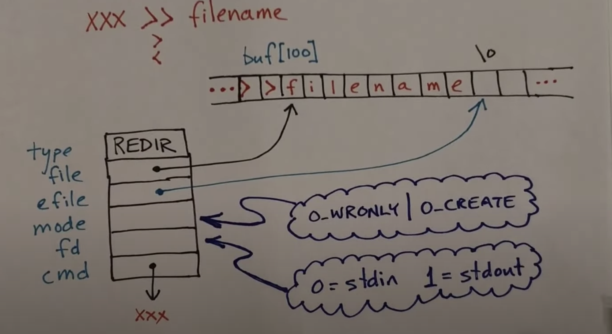

# ARTICLES

## 42Cursus-Minishell by Achraf BELARIF
- [medium link](https://achrafbelarif.medium.com/42cursus-minishell-29cd25f972e6)
- [Minishell by Achraf BELARIF (spydersy)](https://github.com/spydersy/42Cursus-minishell)


> Bash is also a [command processor](https://en.wikipedia.org/wiki/Command-line_interpreter) that typically runs in a text window where the user types commands that cause actions, it supports [wildcard matching](https://tldp.org/LDP/GNU-Linux-Tools-Summary/html/x11655.htm), [piping](https://en.wikipedia.org/wiki/Pipeline_(Unix)),[here documents](https://en.wikipedia.org/wiki/Here_document), [command substitution](https://en.wikipedia.org/wiki/Command_substitution), [variables](https://en.wikipedia.org/wiki/Variable_(programming))

### Subject summary

- Show a prompt when waiting for a new command.
- Have a working History.
- Search and launch the right executable (based on the PATH variable or by using relative or absolute path).
- Implement the builtins:
	- `echo` with -n
	- `cd` with only a relative or absolute path
	- `pwd` (no flags)
	- `export` (no flags)
	- `unset` (no flags)
	- `env` (no flags or arguments)
	- `exit` (no flags)
	- `’` inhibit all interpretation of a sequence of characters.
	- `"` inhibit all interpretation of a sequence of characters except for $.
- Redirections:
	- `<` redirect input.
	- `>` redirect output.
	- `<<` read input from the current source until a line containing only the delimiter is seen. heredoc (doesn't affect history).
	- `>>` should redirect output with append mode.
- Pipes `|`	 The output of each command in the pipeline is connected via a pipe to the input of the next command.
- Semicolons `;	 in the command line must separate the commands.
- Environment variables (`$` followed by characters) should expand to their values.
- `$?` should expand to the exit status of the most recently executed foreground pipeline.
- `ctrl-C`, `ctrl-D` and `ctrl-\` should work like in bash.
- The code should not produce leaks.

### Main program

```c
/* readline returns the text of the line read.			*/
/* A blank line returns the empty string.			*/
/* If EOF is encountered (e.q ctrl-D) while reading a line,	*/
/* and the line is empty, NULL is returned.			*/
/* Lexer  is the process of converting a sequence of		*/
/* characters into a sequence of tokens. If the line is 	*/
/* validated tokens are parsed to be executed, otherwise	*/
/* there is no need						*/
	
int	main(int argc, char **argv, char **envp)
{
	signal_handler();
	while (!SIGQUIT && cmd != NULL)
	{
		char	*line = readline();

		if (line == NULL || !strcmp(line, "exit"))
			exit;
		if (lexer(line))
		{
			t_data *data = parser(line, envp);
			execution(data, envp);
		}
	}
	return (0);
}
```

### Project Steps or BASH/Minishell Life cycle as an Infinite loop

1. Read line from `stdin`: used functions:
	- `char *readline(const char *prompt)`: will read a line from the terminal and return it, using **prompt** as a prompt.
	- `add_history()` : allows using directional keys `↑` and `↓` .
2. *Lexer(Lexical Analyzer)*: checks the syntax of the commands based on [BASH GRAMMAR}](https://pubs.opengroup.org/onlinepubs/009695399/utilities/xcu_chap02.html) and puts the characters together into words called **"TOKENS"**. Example of *Command table*:

```txt
/* Example For the line : cat < "Makefile" | grep something > outfile | wc -l < outfile */
	
/---------------------------------------------------\
| PIPE_LINE|  CMD|      ARGS|   IN_REDIR|  OUT_REDIR|
|---------------------------------------------------|
|        00|  cat|      NULL| "Makefile"|       NULL|
|        01| grep| something|       NULL|    outfile|
|        02|   wc|        -l|    outfile|       NULL|
\---------------------------------------------------/
```

3. *Parser*: that processes the tokens according to grammar and builds the *"COMMAND TABLE"*.
4. *Execution* : Execute the line.


## Minishell

- [Minishell by maiadegraaf](https://github.com/maiadegraaf/minishell)

*Shell* is a program that the user can use to interact with an operating system's services
*Bash* is the GNU shell

Usefull article [Chapter 5. Writing Your Own Shell](https://www.cs.purdue.edu/homes/grr/SystemsProgrammingBook/Book/Chapter5-WritingYourOwnShell.pdf)

4 Steps:

1. Lexer
2. Parser
3. Expander
4. Executor

Example for 4 Steps :

1. *Input* : `ls -l | grep a > file`
2. *Lexer* determime **words** and **tokens**
	- **words** : `ls`, `-l`, `grep`, `a`, `file`
	- **tokens** : `|`, `>`
3. *Parser*

```txt
| command | flags | in     |  out |
| ------- | ----- | ------ | -----|
| ls      |  -l   | STD:IN | pipe |
| grep    |  a    | pipe   | file |
```
4. Executor

### Implementation

Minishell runs without arguments. As opossite to *bash* no action or returns and error if an arg is given.

#### Start

There are two functions:

1. `minishell_loop` performs the function of minishell
	- use *readline* that allows to use built-in history function.
2. other that cleans up and prepares for next line.
	- checks any unclosed quotes. If it doesn't find any it sends the line to the lexer.

#### Lexer or Tokenizer

Takes the entered line as input.
Use space as delimiter for detect words.
Detect if a word is a token : `|`, `<`, `<<`, `>`, `>>`. If not, a word is word.

He use a linked list with this struct:

```c
typedef struct	s_lexer
{
	char			*str;
	t_tokens		token;
	int				i;
	struct s_lexer	*next;
	struct s_lexer	*prev;
}				t_lexer;
```

Where *t_tokens* is *type enum*

#### Parser

The parser groups the different nodes together based on the tokens. Each group becomes a command.

Struct for parser: (used for define a commnands list)

```c
typedef struct	s_simple_cmds
{
	char					**str;
	int                     (*builtin)(t_tools *, struct s_simple_cmds *);
	int                     num_redirections;
	char                    *hd_file_name;
	t_lexer                 *redirections;
	struct s_simple_cmds	*next;
	struct s_simple_cmds	*prev;
}				t_simple_cmds;
```

Steps for parser. It's a loop:
1. Find a node with a pipe in the lexer list.
2. If a node with a pipe is detected all previous nodes are one command. So creates a *t_simple_cmds* node in a command list.
3. If no pipe is found , all remaning nodes are one command.

Example of list used:

1. Original commnad  : `ls -l | echo a > file`
2. t_lexer list (each line is a node)

| id | st   r | token |
| -- | ---    | ----- | 
| 1  | ls     |       |
| 2  | -l     |       |
| 3  |        |  '|'  | (split on pipe)
| 4  | echo a |       |
| 5  |        |  '>'  |
| 6  | file   |       |

3.  t_simple_cmds list (there are two nodes):
	- Node 1:
		- `**str = "ls -l"`
		- `(*buildin) = NULL`
		- `*redirection = NULL`
	- Node 2:
		- `**str = "echo a"`
		- `(*builitin) = echo `    it's a pointer to the corresponding implemented function
		- `*redirection = > file`     this part is deleted from *t_lexer list*
	
For each command in lexer list:
	- checks for redirections in lexer list and store in the redirection linked list. It holds:
		- token
		- file name or delimiter (used by heredoc)
	- delete redirections from lexer list.
	- Checks if fist word in *str* is a *builtin* so a pointer point to the implemented function  in *minishell* 

**240115** revisar como pone la redireccion en t_simple_cmd y la borra de t_lexer

#### Builtins

Easy to check :

```c
if (cmd->builtin != NULL)
  cmd->builtin(tools, cmd);
```

Commands :

- *cd* 
	- Changes the working directory of the current shell execution environment and updates the environment variables *PWD* and *OLDPWD*.
	- Without arguments it change the working directory to the home directory.
	- `-` changes the directory to the *OLDPWD*.
- *echo*
	- Displays a line of text
	- Optional flag `-n`: do not output the trailing newline
- *env*:
	- Displays the environment variables
- *exit*
	- Terminates the shell.
	- Accepts optional argument `n`, which sets the exit status to *n*.
- *export*
	- Accepts arguments `name[=value]`.
	- Adds name to the environment. Set's value of name to `value`.
	- If no argument is given, displays list of exported variables.
- *pwd*
	- Shows the current directory as an absolute path.
- *unset*
	- Accepts argument `name`.
	- Removes the variable name from the environment.

He uses an array with those functions name   

#### Executor

##### Expander

Before a node from `t_simple_cmds` is handled it is expanded. The expander takes variables, identified by `$`, and replaces them with their value from the environment variables. Such that `$USER` becomes `mgraaf`, and `$?` is replaced with the exit code.

##### Heredoc

##### Single command

##### Multiple commands

##### Reset

The program then does a full reset, freeing all nodes that have not been freed or deleted yet, and resets various variables so that the program can start again by displaying a new prompt.

### Examples for test the program

```sh
ls -la | grep a | tr 'a-z' 'A-Z'
```

```sh
cat << EOF > file
cat file
rm file
```

```sh
ls | rev > file
cat file
rev file | cat
rm file
```

to exit the program:

```sh
exit
```

## Minishell: Building a mini-bash (a @42 project)

- [medium link](https://m4nnb3ll.medium.com/minishell-building-a-mini-bash-a-42-project-b55a10598218)
- [Minishell by m4nnb3ll in Github](https://github.com/m4nnb3ll/minishell)

Research about bash :

**Front End**
User input and user interaction, like commands and signals

1. command (user input as a line/string) 
2. a signal (ctrl + C, etc…) - He choses to postpone signals until finish the execution

**Back End** : Execution


**User-input** Options to consider:
1. "hard-code" parsing and naively treating cases. (análisis "codificado" y al tratamiento ingenuo de los casos.)
2. bash parses commands (two phases):
	- lexical analysis (lexing) which produces "lexems" **abstraction**
		- **lexical analysis / tokenization**: taking the input from the user and processing it char by char into **tokens**.
	- **syntax analysis / parsing**: scanning the stream of tokens according to a specific grammar and then deciding what to do with them .(e.g. generating an **ast — abstract syntax tree**).


steps:
- what is grammar? there are several . he chooses [cfg (context free grammar)](https://en.wikipedia.org/wiki/context-free_grammar)

exemple:

```txt
//the following grammar is written in backus-nauer form

<expression>  :=  <number>
              |   <number> ‘+’ <expression>

<number>      :=  one or more digits
```

> an expression can be a number or a number followed by a + sign that is followed by another expression, and a number can be one or more digits.

the recursive descent -> you will have to build a [parse tree](https://en.wikipedia.org/wiki/parse_tree) first and then convert it into an ast (abstract syntax tree).

algorithms:
- **precedence climbing**. (*choosed by the author because he thinks this algorithm is more simple*). example : [parsing expressions by precedence climbing](https://eli.thegreenplace.net/2012/08/02/parsing-expressions-by-precedence-climbing)
- [the recursive descent](https://en.wikipedia.org/wiki/recursive_descent_parser). also commented by *hhp3 del mit*. other possible resources: [articles in tag "recursive descent parsing"](https://eli.thegreenplace.net/tag/recursive-descent-parsing)
- [the shunting-yard algorithm](https://en.wikipedia.org/wiki/shunting_yard_algorithm)

initialize ast tasks:

- *the expansion of environment variables*
	- [glob](https://en.wiikipedia.org/wiki/glob_(programming)
	- backtracking algorithm ->[wildcard pattern matching](https://www.geeksforgeeks.org/wildcard-pattern-matching/)
- *here-doc initialization*: is where here-doc gets initialized by storing the input in a pipe [pipe() system call](https://www.geeksforgeeks.org/pipe-system-call/) which will be used later by the execution — **though we have to make sure to close the corresponding file descriptors, else the program may freeze somewhere**.

- *the execution*.
	- it receives **ast — abstract syntax tree**
	- traverses ast built to parsing phase (analysis phase). pseudo code example (**pipe** can be `|`  used un mandatory part, `||` or `&&` used in bonus part)

``` c
int execute(t_node node)
{
	if (node.type == pipe)
		return (execute_pipe(node.left, node.right));
	else
		return (execute_simple_command(node.value))
}
```

- after finish execution:  
	- open a file redirection the standard input or the standard output to that file, and in case of the **here-doc** , authors redirect the standard input to a pipe. the redirection can be doen using [dup2](https://en.wikipedia.org/wiki/dup_(system_call))
	- for *here-doc* redirect the standard input to a pipe
	- `ctrl + c`, `ctrl + \`, catch *sigint* and *sigquit* respectively
	- `ctrl + d` check the eof or the end of string (i.e. null character).

## [parsing expressions by precedence climbing (by eli bendersky)](https://eli.thegreenplace.net/2012/08/02/parsing-expressions-by-precedence-climbing)

Concepts : 
- Precedence
- Associativy: *left associative* operators stick to the left stronger than to the right; *right associative* operators vice versa
- Nested parenthesized sub-expressions : first compute expresion inside parenthesis

Precedence :
- precedence 1 : + , -
- precedence 2 : * , /
- precedence 3 : ^

Associativy :
- *left associative* : + , -
- *right associative* : ^

### Precedence climbing - how it actually works

Terms: (these two terms are mutually dependent)
- Atoms are either numbers or parenthesized expressions.
- Expressions consist of atoms connected by binary operators


Pseudo:
```txt
compute_expr(min_prec):
  result = compute_atom()

  while cur token is a binary operator with precedence >= min_prec:
    prec, assoc = precedence and associativity of current token
    if assoc is left:
      next_min_prec = prec + 1
    else:
      next_min_prec = prec
    rhs = compute_expr(next_min_prec)
    result = compute operator(result, rhs)

  return result
```

### Example using pseudo

Expresion to evaluate : `2 + 3 ^ 2 * 3 + 4`

```txt
* compute_expr(1)                # Initial call on the whole expression
  * compute_atom() --> 2
  * compute_expr(2)              # Loop entered, operator '+'
    * compute_atom() --> 3
    * compute_expr(3)
      * compute_atom() --> 2
      * result --> 2             # Loop not entered for '*' (prec < '^')
    * result = 3 ^ 2 --> 9
    * compute_expr(3)       //  No entiendo por que usa 3
      * compute_atom() --> 3
      * result --> 3             # Loop not entered for '+' (prec < '*')
    * result = 9 * 3 --> 27
  * result = 2 + 27 --> 29
  * compute_expr(2)              # Loop entered, operator '+'
    * compute_atom() --> 4
    * result --> 4               # Loop not entered - end of expression
  * result = 29 + 4 --> 33
```


## [youtube-shell program explained](https://www.youtube.com/watch?v=ubt-ujcquyg)

based on a mit shell **xv6**

### main loop

```txt
while(1)
	print promt
	read a line
	parse:
		-> build tree representation
	execute
```

### examples + features

#### shell invocation examples

*pgm*, *pgm1*, *pgm2* are program names 

- `pgm -r -i /usr/filename`  where  *-r -i /usr/filename* are options
- `pgm < infile > outfile` where *< infile > outfile* is i/o redirection
- `pgm < infile >> outfile` where *< infile >> outfile*  is i/o redirection
- `pgm1 | pgm2 | pgm3` where *|* are pipes
- `pgm1 ; pgm2 ; pgm3` where *;* are sequencing
- `pgm  &` where *&* indicate that *pgm* runs in **background**
- `(pgm1 ; pgm2) | pgm3` where *(...)* to to grouping

> **&** forma parte del bonus del enunciado

#### Built-in Command

- `cd pathname`

#### Mising [1:49 - 2:33]

There are several commands/options no soported.

#### System Calls [2:48 - 3:05]

Unix command used in MIT shell **xv6**

#### CLI example : `( pgm1 -i arg < myFile | pgm2) ; pgm3 arg3` [3:31 - ]

##### Put the comman line in a tree format for Recursive Descent Parsing

- `;` divides the execution in two parts or children.
- For the child with `pgm1 -i arg < myFile | pgm2` the `|` dived the command in two new children

The execution procces is:

1. `myFile` is reaad by `pgm1 -i arg`
2. the output of `pgm1 -i arg` is input for pgm2 anmd executes `pgm2`
3. Executes `pgm3 arg3`

##### Execution procces steps in algorithm 

- **parsecmd** recursive descent parrser
- **runcmd** :
	- walk the three recursively.
	- "executes" the node.
	- create child processes (**fork**) as required

##### Structs for node three

Use *define* constants for type in struct that is a node in the tree

```c
#define EXEC 1
#define REDIR 2
#define PIPE 3
#define LIST 4
#define BACK 5
```

- `xxx | yyy`

```c
type = PIPE
*left = xxx
*right = yyy
```

- `xxx ; yyy`

```c
type = LIST
*left = xxx
*right = yyy
```

- `xxx &`

```c
type = BACK
*cmd = xxx
```


##### Structs for buffer command. Example using pipe |

- Use a buf[100] where is the command `myPgm -i arg | ...` and use a struct

The struct simulate a split for the command in several *strings*

```
type = EXEC
*argv[] is a array of *char that points to several positons in buf[100]
*eargv[] is a array of *char that points to several positons in buf[100]
```

*e* is to define where ends arguments. Each pointer inside *ergv[]* point to each space that can simulate the `\0` to determine the end of a string 


##### Structs for buffer command. Example using redirections : > , < , >>, <<

Instructions can be :

- `xxx >> filename`
- `xxx > filename`
- `xxx < filename`

Use a buf[100] where is the command `>>filename` and use a struct

```
type = REDIR
*file
*efile
mode=O_WRONLY | O_CREATE
fd=
cmd = xxx
```

where:
- *fd*  can be 0 = stdin , 1 = stdout or otrher
- *file* points to the first char of *file* in buf[100]
- *efile* points to next char position at the end of *file*. It's si  ilar to pint to char `\0`



##### Struct and functions

| Structs | "constructor" functions |
| -------  | -------  |
| pipecmd  | pipecmd  |
| listcmd  | listcmd  |
| backcmd  | backcmd  |
| execcmd  | execcmd  |
| redircmd | redircmd |

Functions :
- *parsecmd* : pointer to buf -> ptr to tree

Functions related with *Reverse Recursive Parsing*:
- *parseline*
- *parsepipe*
- *parseredirs*
- *parseblock*
- *parseexec*
- *nulterminate*  is the function that recursively walks the tree and replaces those characters by `\0` to determine the null string end.
- *gettoken* identify where the next token occurs

Other functions:
- *main*
- *getcmd* : print `$` and read stdin to buf
- *runcmd* : walk tree and execution
- *panic* : print error message and terminate process
- *fork1* : wrapper function for `fork`

```c
void panic (char *s)
{
	fprintf(2, "%s\n", n);
	exit(1);
}

int	fork1(void)
{
	int	pid;

	pid = fork();
	if(pid == -1)
		panic("fork");
	return (pid);
}
```

In the main , check if the fist comand is a **cd** . Becauise the parent procces must *cd* command before estart any child process.

## [Recursive Descent Parsing](https://www.youtube.com/watch?v=SToUyjAsaFk&list=PLGU1kcPKHMKj5yA0RPb5AK4QAhexmQwrW&index=20)

**OUTLINE**
- Format of input: Grammar, Syntax
- Representation of Result/Output
- The parsing Algorithm 
- Evalutaion of 


